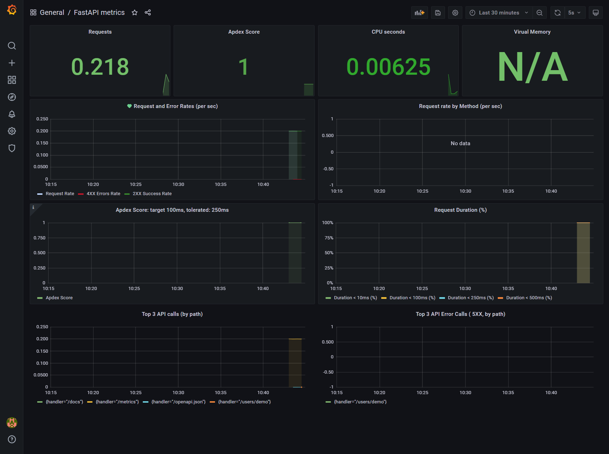

# Diary

🚧 **not ready yet** 🚧


```
Diary
├─ docker-compose.yaml
├─ fastapi
│  ├─ alembic
│  │  ├─ env.py
│  │  ├─ README
│  │  ├─ script.py.mako
│  │  └─ versions
│  │     └─ 73e046ff2fd0_baseline.py
│  ├─ alembic.ini
│  ├─ app
│  │  ├─ api
│  │  │  ├─ api.py
│  │  │  ├─ deps.py
│  │  │  └─ endpoints
│  │  │     ├─ login.py
│  │  │     ├─ posts.py
│  │  │     └─ users.py
│  │  ├─ config.py
│  │  ├─ core
│  │  │  └─ security.py
│  │  ├─ crud
│  │  │  ├─ base.py
│  │  │  ├─ crud_post.py
│  │  │  ├─ crud_user.py
│  │  │  └─ __init__.py
│  │  ├─ db
│  │  │  ├─ base.py
│  │  │  ├─ base_class.py
│  │  │  ├─ init_db.py
│  │  │  └─ session.py
│  │  ├─ diary.db
│  │  ├─ main.py
│  │  ├─ models
│  │  │  ├─ post.py
│  │  │  ├─ user.py
│  │  │  └─ __init__.py
│  │  ├─ monitoring
│  │  │  └─ opentelemetry.py
│  │  └─ schemas
│  │     ├─ post.py
│  │     ├─ token.py
│  │     ├─ user.py
│  │     └─ __init__.py
│  ├─ Dockerfile
│  └─ reset_db.sh
├─ grafana
│  ├─ dashboards
│  │  ├─ dashboards.yml
│  │  └─ fastapi.json
│  ├─ datasources
│  │  └─ datasources.yml
│  └─ Dockerfile
├─ images
│  └─ grafana.png
├─ prometheus
│  └─ prometheus.yml
└─ README.md

```

## Build and start

```bash
docker-compose up --build
```

**Your ports must be free!**

FastAPI:  [http://localhost:8000/docs](http://localhost:8000/docs)

Grafana:  [http://localhost:3000](http://localhost:3000)

login and password are **admin**, dashboard is FastAPI metrics

Prometheus : [http://localhost:9090](http://localhost:9090)

pick a metric like *prometheus_http_requests_total* on [http://localhost:9090/metrics](http://localhost:9090/metrics)


